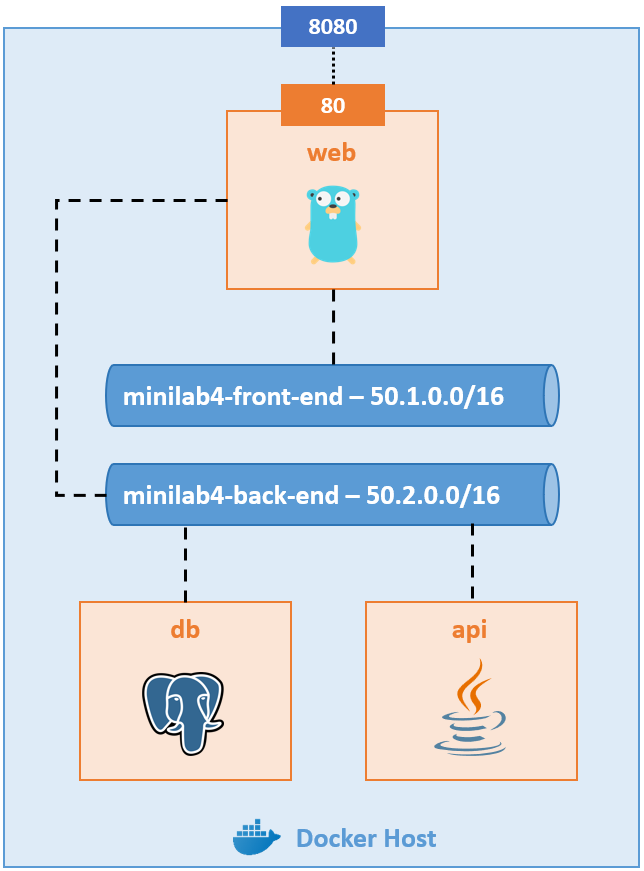

# Minilab 4 - Wordsmith

### Architecture

Wordsmith est une application démo qui a été présentée pour la première fois lors de la DockerCon EU en 2017 et 2018. Elle s'héberge dans l'architecture suivante :

### Ressources

Crééez cette architecture à l'aide de la Docker CLI :

- Réseau front
    - **Nom** - minilab4-front-end
    - **Adresse de sous-réseau** - 50.1.0.0/16
    - **Driver** - bridge

- Réseau back
    - **Nom** - minilab4-back-end
    - **Adresse de sous-réseau** - 50.2.0.0/16
    - **Driver** - bridge

- Front
    - **Nom** - web
    - **Image** - image custom construite à partir des sources localisées [ici](./src/web/)
    - **Réseau** - minilab4-front-end et minilab4-back-end
    - **Port-mapping** - Port 8080 du Docker Host avec le port 80 du conteneur

- API
    - **Nom** - api
    - **Image** - image custom construite à partir des sources localisées [ici](./src/api/)
    - **Réseau** - minilab4-back-end

- Base de données
    - **Nom** - db
    - **Image** - postgres
    - **Version de l'image** - 10.0-alpine
    - **Réseau** - minilab4-back-end
    - **Données** - Le fichier [words.sql](./src/db/words.sql) doit être placé dans le répertoire /docker-entrypoint-initdb.d/ du conteneur

### Tests

- Accédez à l'application via l'URL http://localhost:8080